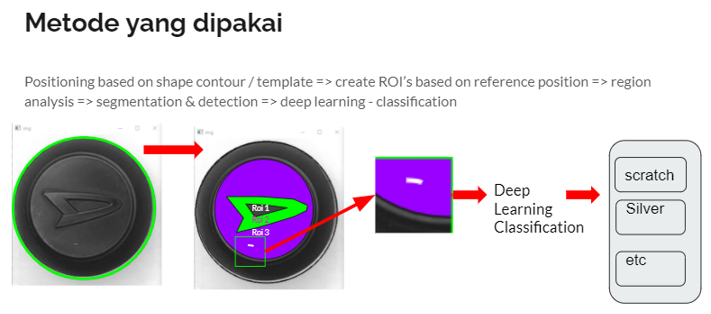
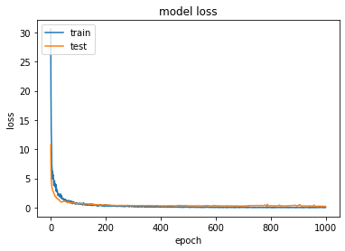
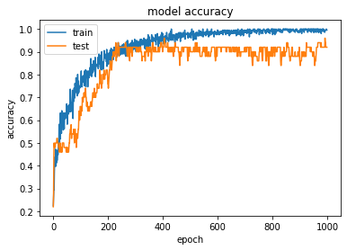

# 🔍 Automated Camera Inspection System

## 📌 Project Description
This project was developed during an internship at **PT Stechoq Robotika Indonesia** as part of an **Automated Camera Inspection System**.  
The system leverages **Deep Learning (CNN)** to automatically classify and detect product defects captured by a camera, improving inspection efficiency and consistency in a manufacturing environment.

---

## 🛠️ Tech Stack
- **Python**
- **TensorFlow / Keras**
- **OpenCV**
- **NumPy**
- **Matplotlib**
- **Scikit-learn**
- **Google Colab**

---

## 🚀 Features
- **Data Preprocessing**: image resizing, normalization, ROI extraction.  
- **CNN Model Training**: custom Convolutional Neural Network for defect classification.  
- **Evaluation**: confusion matrix and classification report for model validation.  
- **Inference**: predict defect class on new product images.  
- **Workflow Integration**: integrated into an automated camera-based inspection system.  

---

## 🧭 Project Methodology

The defect inspection pipeline follows these steps:

1. **Positioning**  
   - Based on shape contour/template.  
   - Create ROIs (Regions of Interest) from reference positions.  

2. **Region Analysis**  
   - Segmentation and detection of selected ROIs.  

3. **Deep Learning Classification**  
   - CNN model classifies defects into categories such as *Scratch*, *Silver*, etc.  

### Workflow Illustration


---

## 📊 Experimental Results
- **Training Accuracy**: ~99%  
- **Testing Accuracy**: ~92%  
- **Loss** decreased rapidly in early epochs and stabilized after ~200 epochs.  

### Training Graphs
  
*Training vs validation loss*  

  
*Training vs validation accuracy*  

  
*Model evaluation on the test dataset*  

---

## 📈 Evaluation
Run the evaluation script:

```python
from src.evaluation import evaluate_model

class_names = ["OK", "Scratch", "Silver", "Other"]  # adjust to your dataset
evaluate_model(model, X_test, y_test, class_names, output_dir="results")
